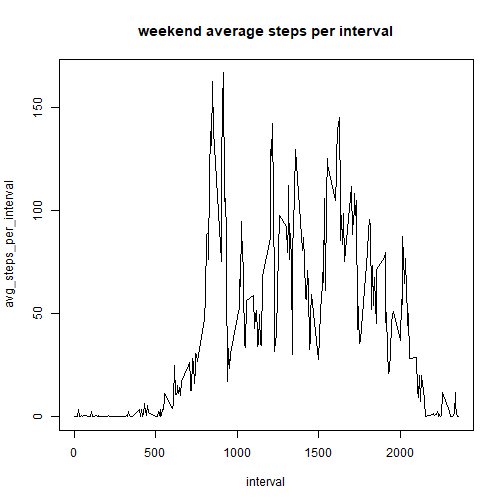

# Reproducible Research assignment 1

## Loading and preprocessing the data

### Load the data


```r
setwd("E:/repdata_data_activity")

activity <- read.csv("activity.csv")

str(activity)
```

```
## 'data.frame':	17568 obs. of  3 variables:
##  $ steps   : int  NA NA NA NA NA NA NA NA NA NA ...
##  $ date    : Factor w/ 61 levels "2012-10-01","2012-10-02",..: 1 1 1 1 1 1 1 1 1 1 ...
##  $ interval: int  0 5 10 15 20 25 30 35 40 45 ...
```

## What is mean total number of steps taken per day?

### Calculate the total number of steps taken per day


```r
library(dplyr)

activity %>%
  group_by(date) %>%
  summarise(
    total_steps_per_day = sum(steps, na.rm = TRUE)
  ) -> total_steps_each_day 

total_steps_each_day
```

```
## # A tibble: 61 x 2
##    date       total_steps_per_day
##    <fct>                    <int>
##  1 2012-10-01                   0
##  2 2012-10-02                 126
##  3 2012-10-03               11352
##  4 2012-10-04               12116
##  5 2012-10-05               13294
##  6 2012-10-06               15420
##  7 2012-10-07               11015
##  8 2012-10-08                   0
##  9 2012-10-09               12811
## 10 2012-10-10                9900
## # ... with 51 more rows
```
 
### Histogram of the total number of steps taken each day


```r
hist(total_steps_each_day[,2])
```


### mean and median of the total number of steps taken per day


```r
total_steps_each_day %>%
  summarise(
    mean_steps_per_day = mean(total_steps_per_day, na.rm = TRUE)
  ) 
```

```
## # A tibble: 1 x 1
##   mean_steps_per_day
##                <dbl>
## 1              9354.
```

```r
total_steps_each_day %>%
  summarise(
    median_steps_per_day = median(total_steps_per_day, na.rm = TRUE)
  ) 
```

```
## # A tibble: 1 x 1
##   median_steps_per_day
##                  <int>
## 1                10395
```

mean steps taken per day: 9354
median steps taken per day: 10395

## What is the average daily activity pattern?

Make a time series plot of the 5-minute interval (x-axis) and the average number of steps taken, averaged across all days (y-axis)


```r
activity %>%
  group_by(interval) %>%
  summarise(
    avg_steps_per_interval = mean(steps, na.rm = TRUE)
  ) -> avg_steps_per_interval

plot(avg_steps_per_interval,type="l")
```


Which 5-minute interval, on average across all the days in the dataset, contains the maximum number of steps?

Sort the average steps per interval in descending order and the top row of the table will have the maximum number of steps.


```r
avg_steps_per_interval %>% 
  arrange(desc(avg_steps_per_interval)) -> avg_steps_per_interval_desc

avg_steps_per_interval_desc[1,]
```

```
## # A tibble: 1 x 2
##   interval avg_steps_per_interval
##      <int>                  <dbl>
## 1      835                   206.
```
Interval at 835 minutes has highest number of steps taken averaged across all days

## Imputing missing values

### Calculate and report the total number of missing values in the dataset


```r
colSums(is.na(activity))
```

```
##    steps     date interval 
##     2304        0        0
```

There are 2304 missing values in the dataset

### Impute missing values with mean steps for that interval

Firstly, create a merged table to include the average steps per interval information to the original table

```r
merged <- inner_join(activity,avg_steps_per_interval)
```

```
## Joining, by = "interval"
```

```r
head(merged)
```

```
##   steps       date interval avg_steps_per_interval
## 1    NA 2012-10-01        0              1.7169811
## 2    NA 2012-10-01        5              0.3396226
## 3    NA 2012-10-01       10              0.1320755
## 4    NA 2012-10-01       15              0.1509434
## 5    NA 2012-10-01       20              0.0754717
## 6    NA 2012-10-01       25              2.0943396
```

Impute missing data with the average steps per interval


```r
for(i in 1:nrow(activity)){
  if(is.na(activity[i,1] == TRUE)){
  activity[i, 1] <- merged[i,4] 
  }
}

head(activity)
```

```
##       steps       date interval
## 1 1.7169811 2012-10-01        0
## 2 0.3396226 2012-10-01        5
## 3 0.1320755 2012-10-01       10
## 4 0.1509434 2012-10-01       15
## 5 0.0754717 2012-10-01       20
## 6 2.0943396 2012-10-01       25
```

### Summary of imputed data
Make a histogram of the total number of steps taken each day and 


```r
activity %>%
  group_by(date) %>%
  summarise(
    total_steps_per_day = sum(steps, na.rm = TRUE)
  ) -> total_steps_each_day 

total_steps_each_day
```

```
## # A tibble: 61 x 2
##    date       total_steps_per_day
##    <fct>                    <dbl>
##  1 2012-10-01              10766.
##  2 2012-10-02                126 
##  3 2012-10-03              11352 
##  4 2012-10-04              12116 
##  5 2012-10-05              13294 
##  6 2012-10-06              15420 
##  7 2012-10-07              11015 
##  8 2012-10-08              10766.
##  9 2012-10-09              12811 
## 10 2012-10-10               9900 
## # ... with 51 more rows
```

```r
hist(total_steps_each_day[,2])
```


Calculate and report the mean and median total number of steps taken per day. 


```r
total_steps_each_day %>%
  summarise(
    mean_steps_per_day = mean(total_steps_per_day, na.rm = TRUE)
  ) 
```

```
## # A tibble: 1 x 1
##   mean_steps_per_day
##                <dbl>
## 1             10766.
```

```r
total_steps_each_day %>%
  summarise(
    median_steps_per_day = median(total_steps_per_day, na.rm = TRUE)
  ) 
```

```
## # A tibble: 1 x 1
##   median_steps_per_day
##                  <dbl>
## 1               10766.
```

Do these values differ from the estimates from the first part of the assignment? 
Yes, the values are different.

What is the impact of imputing missing data on the estimates of the total daily number of steps?
The values are increased slightly.

## Are there differences in activity patterns between weekdays and weekends?
Indicating whether a given date is a weekday or weekend day.

Firstly, determine the day from the date. Then determine if the day is a weekday or weekend.


```r
activity$day <- weekdays(as.Date(activity$date))
head(activity)
```

```
##       steps       date interval    day
## 1 1.7169811 2012-10-01        0 Monday
## 2 0.3396226 2012-10-01        5 Monday
## 3 0.1320755 2012-10-01       10 Monday
## 4 0.1509434 2012-10-01       15 Monday
## 5 0.0754717 2012-10-01       20 Monday
## 6 2.0943396 2012-10-01       25 Monday
```

```r
weekday_or_weekend <- vector(mode = "list", length = 17568)

for(i in 1:nrow(activity)){
  if(activity[i,4] == "Saturday"){
  weekday_or_weekend[[i]] <- "weekend" } else if (activity[i,4] == "Sunday"){
  weekday_or_weekend[[i]] <- "weekend" } else {
  weekday_or_weekend[[i]] <- "weekday"
  }
}

activity$weekday_or_weekend <- weekday_or_weekend

head(activity)
```

```
##       steps       date interval    day weekday_or_weekend
## 1 1.7169811 2012-10-01        0 Monday            weekday
## 2 0.3396226 2012-10-01        5 Monday            weekday
## 3 0.1320755 2012-10-01       10 Monday            weekday
## 4 0.1509434 2012-10-01       15 Monday            weekday
## 5 0.0754717 2012-10-01       20 Monday            weekday
## 6 2.0943396 2012-10-01       25 Monday            weekday
```

Make a panel plot containing a time series plot of the 5-minute interval (x-axis) and the average number of steps taken, averaged across all weekday days or weekend days (y-axis).

Splitting the table into a weekday only table and weekend only table for plotting.

```r
activity %>% 
filter(weekday_or_weekend == "weekday") -> activity_weekday

dim(activity_weekday)
```

```
## [1] 12960     5
```

```r
activity %>% 
filter(weekday_or_weekend == "weekend") -> activity_weekend

dim(activity_weekend)
```

```
## [1] 4608    5
```

Calculating the average steps per interval across the days for only weekdays and only weekends. Then plot them seperately.


```r
activity_weekday %>%
  group_by(interval) %>%
  summarise(
    avg_steps_per_interval = mean(steps, na.rm = TRUE)
  ) -> avg_steps_per_interval_weekday

plot(avg_steps_per_interval_weekday,type="l",main="weekday average steps per interval")
```


```r
activity_weekend %>%
  group_by(interval) %>%
  summarise(
    avg_steps_per_interval = mean(steps, na.rm = TRUE)
  ) -> avg_steps_per_interval_weekend

plot(avg_steps_per_interval_weekend,type="l",main="weekend average steps per interval")
```


